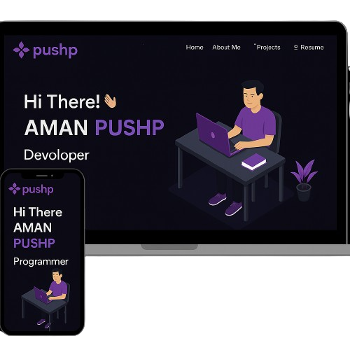

<p align="center">
  
</p>

<h1 align="center">
  🚀 Personal Portfolio<br>
  
</h1>

<p align="center">
  
  
  
</p>

<p align="center">
  
</p>

---

## ✨ Preview

<div align="center">
  
</div>


## 🚀 My Futuristic Portfolio

> "Designing solutions for tomorrow, today."

[](https://amanpushp.netlify.app/)

✨ Explore my personal website to see:
- 💡 Featured Projects
- 🛠️ Tech Stack & Skills
- 📄 Resume
- 📬 Contact Info

🔗 **Live Now:** [https://amanpushp.netlify.app](https://amanpushp.netlify.app)


> Made with passion, built for impact.


> 🎥 *Live animations, smooth transitions, and a space-age UI built with love.*

---

## 🌟 What's New

- 🪄 **Particle.js background effects**
- 🎨 **Animated gradient headers**
- 🌌 **Scroll-based reveal animations**
- 📂 **Blog and project sections dynamically rendered**

---

## 🚀 Features

- ⚡ Smooth page transitions with **Framer Motion**
- 🌗 Light/Dark theme toggle
- 📱 Fully responsive across all devices
- 🌐 Glassmorphism/Neumorphism modern aesthetics
- 🔧 Modular components for scalability

---

## 🧠 Skills & Technologies

<p align="center">
  
</p>


## 🛠 Tech Stack

| Tech               | Description                    |
|--------------------|--------------------------------|
| **React.js**       | UI Framework                   |
| **Framer Motion**  | Animations & Transitions       |
| **Tailwind CSS**   | Utility-first CSS styling      |
| **React Icons**    | Icon pack                      |
| **Vercel/Netlify** | Deployment platforms           |

---

## 🧩 Project Setup

```bash
# Clone the project
git clone https://github.com/AMANPUSHP23/Newportfolio.git

# Navigate to project
cd portfolio

# Install dependencies
npm install

# Start development server
npm run dev


📦 Deployment Options
 Netlify

 Vercel

 GitHub Pages (with static export)

👨‍🚀 Author
Aman Pushp


📄 License
This project is licensed under the MIT License — see the LICENSE file for details.

⭐ Show Your Support
If you like this project, please ⭐ the repo and share it with friends!
Let’s connect the tech world with a futuristic touch ✨


⭐ Show Your Support
If you like this project:

Star 🌟 the repo

Share 🗣️ it with your network

Connect 🤝 for collaborations!

Let’s connect the tech world with a futuristic touch ✨

